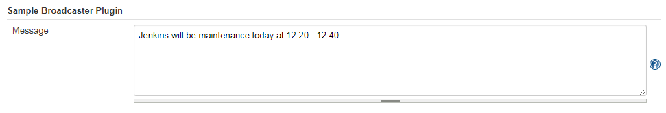

# Simple Broadcaster

This is a very simple Jenkins plugin just for exercise, but it work well as shown bollow.

	
	

		<em>example</em>
	

## Configuration

Go to manage > configure > Simple Broadcaster Plugin, just pust what you want to broadcast in `Message textarea`, for example:

	
	

		<em>configuration</em>
	

