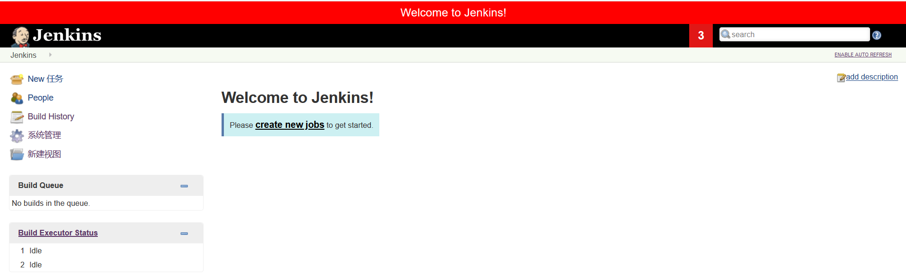
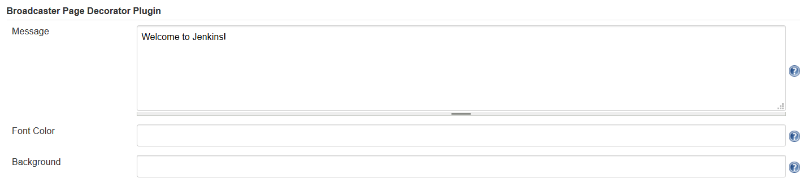

# Broadcaster Page Decorator

This plugin can decorate all pages of Jenkins with your customized message, as shown below.

	
	

		<em>View Example</em>
	

## Installation

Clone this repo in your disk, navigate into folder `broadcaster-page-decorator` and run command `mvn verify`, when it completed, upload `broadcaster-page-decorator/target/broadcaster-page-decorator.hpi` to the update center of Jenkins and install it.

Also you can download `broadcaster-page-decorator.hpi` from [v1.0 release](broadcaster-page-decorator.hpi), then upload to the update center of Jenkins.

## Configuration

Go to manage > configure > Broadcaster Page Decorator Plugin, just pust what you want to broadcast in the `Message textarea`, for example (the font color and background can be modified if needed):

	
	

		<em>Configuration Example</em>
	

